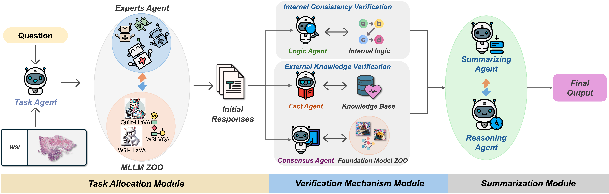

# 🤖 WSI-Agents: A Collaborative Multi-Agent System for Multi-Modal Whole Slide Image Analysis

**WSI-Agents** is a novel collaborative multi-agent system for whole slide image analysis that bridges the gap between accuracy and versatility in digital pathology through specialized agents and robust verification mechanisms.

🎉 **Accepted at MICCAI 2025**

---

## 📂 Resources

🚀 **Code**: Coming Soon  

Framework Overview
The overall framework is based on AutoGen: https://microsoft.github.io/autogen/stable//user-guide/agentchat-user-guide/quickstart.html

You can refer to their official tutorial, and with the help of GPT, implementing it should be quite straightforward.

External Knowledge Base
For the external knowledge base querying, we use LangChain: https://www.langchain.com/

Here's a helpful tutorial that demonstrates how to implement it: https://www.tizi365.com/topic/3555.html

It's actually quite easy to set up.

Text Extraction
The text extraction from books for the knowledge base is done using PaddleOCR's layout recovery feature.

---

## 🏗️ System Overview

WSI-Agents employs a collaborative multi-agent approach to address the accuracy-versatility trade-off in WSI analysis. The system integrates specialized expert agents with comprehensive verification mechanisms to ensure clinical accuracy while maintaining multi-task capabilities.

The architecture consists of three core components: a task allocation module that assigns specialized expert agents, verification mechanisms that ensure accuracy through internal consistency and external knowledge validation, and a summary module that synthesizes final results with visual interpretation.

---

## 🎯 Key Innovations

- **Multi-Agent Collaboration**: Specialized agents for morphology, diagnosis, treatment planning, and report generation
- **Dual Verification**: Internal consistency checking combined with external knowledge validation
- **Knowledge Integration**: Leverages pathology knowledge bases and WSI foundation models
- **Visual Interpretation**: Comprehensive attention maps for explainable analysis

---

## 📊 Performance Highlights

- **WSI-Bench**: Achieves superior performance across morphological analysis, diagnosis, and treatment planning
- **WSI-VQA**: 60.0% accuracy, outperforming existing WSI MLLMs by significant margins
- **Report Generation**: Substantial improvements in clinical report quality and accuracy
- **Consistent Gains**: 10-17% performance improvements across diverse pathology tasks

---
